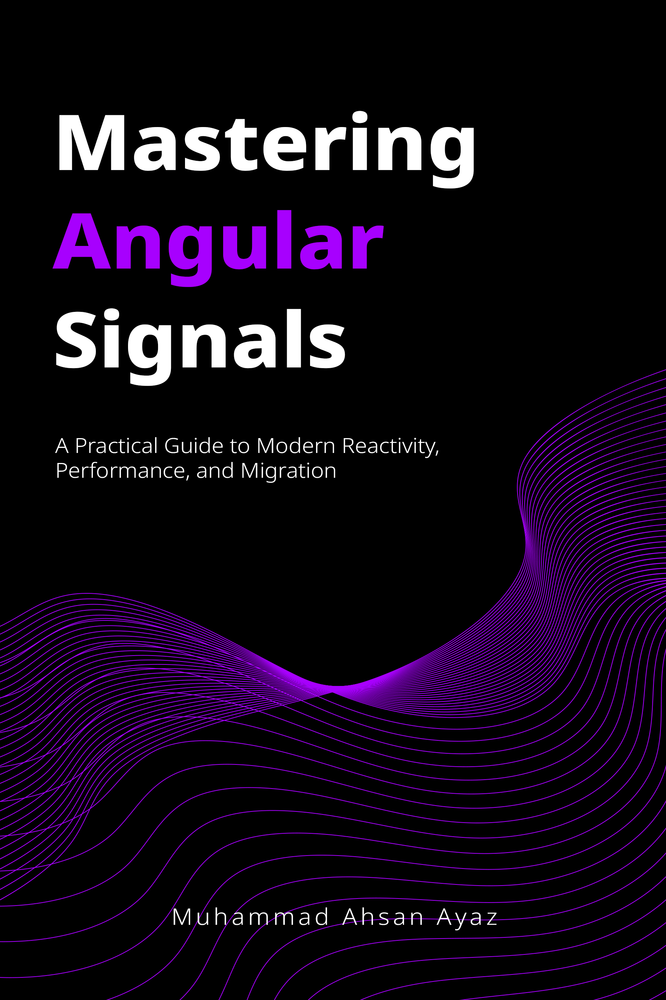

# Angular v22 Demos ⚡

This repository contains practical examples demonstrating the new features introduced in Angular v21 and v22 (like `injectAsync`, `httpResource`, Signal Forms, and template enhancements).

---

## 📚 Mastering Angular Signals (Special Launch Discount!)

<a href="https://leanpub.com/mastering-angular-signals/c/V22LAUNCH?utm_source=youtube&utm_medium=social&utm_campaign=v22-launch" target="_blank">
  
</a>

Accelerate your journey to becoming a master of reactive Angular! Learn how to leverage Signals for state management, build high-performance applications, and prepare your apps for a zoneless future.

👉 **[Get the Book on Leanpub with the launch coupon (V22LAUNCH)](https://leanpub.com/mastering-angular-signals/c/V22LAUNCH?utm_source=youtube&utm_medium=social&utm_campaign=v22-launch)**

What you will learn:
* ⚡ **Core Reactive APIs**: `signal`, `computed`, `effect`, and `linkedSignal`.
* 📡 **Declarative Async**: `resource`, `rxResource`, and HTTP patterns.
* 📋 **Modern Forms**: Building schema-validated reactive Signal Forms.
* 🛠️ **Seamless Migration**: Moving from Observables to Signals step-by-step.
* 🚀 **Zoneless Architecture**: Optimizing change detection and rendering performance.

---

This project was generated using [Angular CLI](https://github.com/angular/angular-cli) version 22.0.1.

## Development server

To start a local development server, run:

```bash
ng serve
```

Once the server is running, open your browser and navigate to `http://localhost:4200/`. The application will automatically reload whenever you modify any of the source files.

## Code scaffolding

Angular CLI includes powerful code scaffolding tools. To generate a new component, run:

```bash
ng generate component component-name
```

For a complete list of available schematics (such as `components`, `directives`, or `pipes`), run:

```bash
ng generate --help
```

## Building

To build the project run:

```bash
ng build
```

This will compile your project and store the build artifacts in the `dist/` directory. By default, the production build optimizes your application for performance and speed.

## Running unit tests

To execute unit tests with the [Vitest](https://vitest.dev/) test runner, use the following command:

```bash
ng test
```

## Running end-to-end tests

For end-to-end (e2e) testing, run:

```bash
ng e2e
```

Angular CLI does not come with an end-to-end testing framework by default. You can choose one that suits your needs.

## Additional Resources

For more information on using the Angular CLI, including detailed command references, visit the [Angular CLI Overview and Command Reference](https://angular.dev/tools/cli) page.
